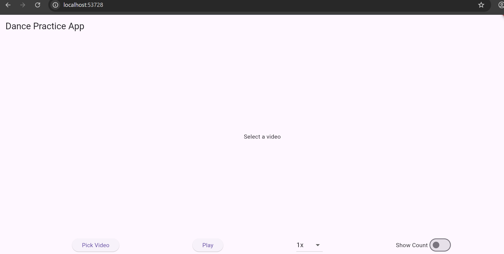
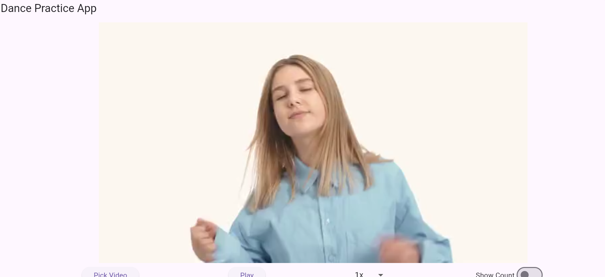
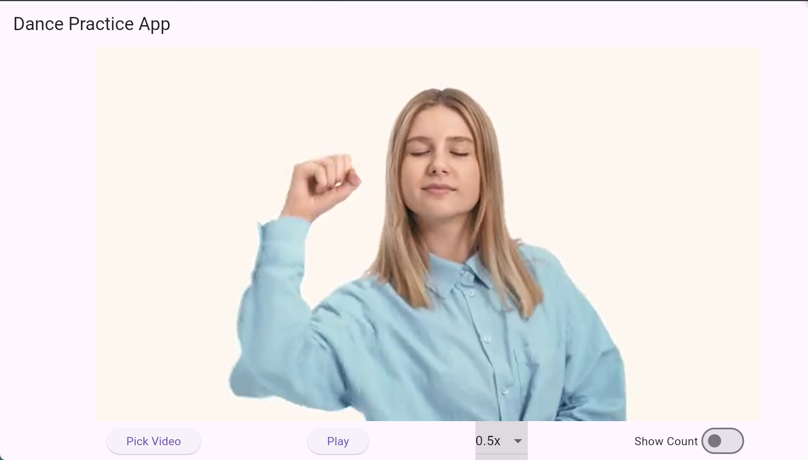

# Dance Practice App

動画を使ってダンスの動きとタイミングを効率よく練習できるFlutterアプリです。

ダンス練習用のFlutterアプリです。  
動画を使った動きの確認や、タイミング練習を目的としています。

## 🎯 想定ユーザー

- ダンス練習をしている方
- 動画でフォームを確認したい方
- タイミングを合わせて練習したい方
  
---

## 機能

- 動画ファイルの読み込み（端末から選択）
- 動画の再生 / 一時停止
- 再生速度変更（0.5x〜1.5x）
- カウント表示（1秒ごと）

---
## 🔧 主な機能

- 動画再生機能
- タイミング練習
- シンプルな操作UI
- 軽量でスムーズな動作
  
---
## 🛠 技術構成

- Flutter (Dart)
- Material UI
- 動画再生制御（再生速度・状態管理）
- Stackを用いたUI重ね表示（カウント表示）
- Webとモバイルでの処理分岐対応
- GitHubでソース管理

---

## 対応環境

- Android
- Web（Chrome）

※ 一部動画形式（movなど）はWebで再生できない場合があります

---
## 💡 工夫した点

- シンプルで直感的に操作できるUI設計
- 動作が重くならないよう軽量化を意識
- 繰り返し練習しやすい構成
- Webとモバイルで動画読み込み処理を分岐
- 動画上にカウントを重ねて表示（Stack使用）
- 再生状態と連動したカウント制御

---
## ⚠️ 苦労した点

- Web環境での動画再生制約への対応
- 再生状態とカウント表示の同期制御
- 異なる環境（Web/モバイル）での処理分岐

## 今後の改善予定

- シークバー追加
- BPMに合わせたカウント機能
- mov → mp4 自動変換（ffmpeg連携）
- UI改善

---
## 📱 画面イメージ

| メイン画面 | 再生画面 |
|------------|----------|
|  |  |

## 動作イメージ

## ▶️ デモ動画

※現在準備中（後日公開予定）
